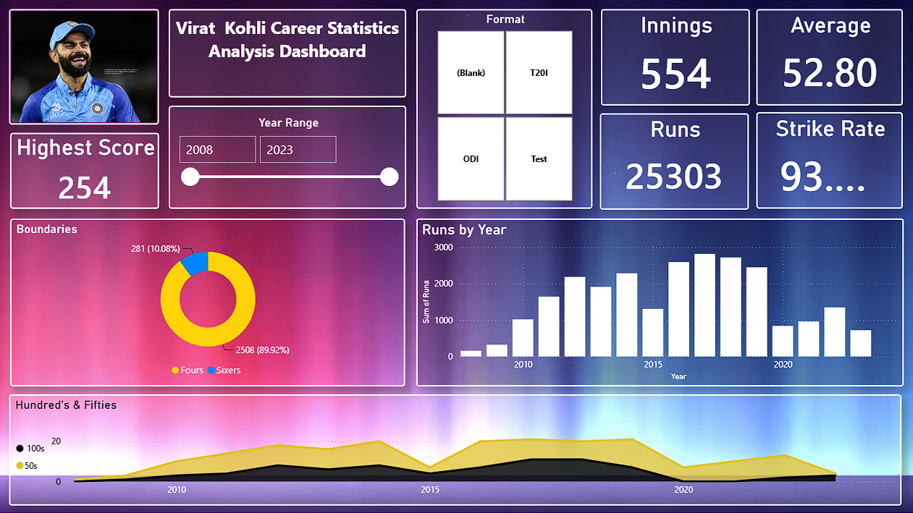

# 🏏 Virat Kohli Career Statistics Dashboard

> Power BI sports analytics dashboard built using Excel web scraping, Power Query, and interactive visualizations across Test, ODI, and T20I formats.

---

## 📌 Overview

This project analyzes Virat Kohli's international cricket career from 2008 to 2023. It covers all three formats, Test, ODI, and T20I, using data scraped directly from the web via Excel IMPORTHTML formulas. The cleaned and structured data powers an interactive Power BI dashboard with year-wise trends, boundary breakdowns, and milestone tracking.

---

## ❓ Problem Statement

Cricket statistics are scattered across multiple sources and formats. There is no single, clean, visual summary of how Kohli's performance evolved across formats and years. This project builds that summary, a recruiter-friendly, data-driven dashboard that answers:

- How did Kohli's run-scoring trend change year over year?
- Which format shows the highest average and strike rate?
- How do his 100s and 50s distribute across his career?
- What is the boundary composition across his 25,000+ runs?

---

## 📂 Dataset

| Detail | Info |
|---|---|
| Source | [cricmetric.com](http://www.cricmetric.com/playerstats.py?player=V%20Kohli) via Excel IMPORTHTML |
| Scraping Method | Excel formula: `=IMPORTHTML(url, "table", n)` |
| Formats Covered | Test, ODI, T20I |
| Year Range | 2008 to 2023 |
| Sheet Structure | Sheet1 (raw scraped data), Overall (cleaned, structured) |
| Columns | Year, Format, Innings, Runs, Balls, Outs, Avg, SR, HS, 50s, 100s, 4s, 6s, Dot% |

---

## 🛠️ Tools and Technologies

| Tool | Purpose |
|---|---|
| Microsoft Excel | Web scraping via IMPORTHTML formula |
| Power Query | Data cleaning and transformation |
| Power BI Desktop | Dashboard building and visualization |
| IMPORTHTML (Excel) | Live data pull from cricmetric.com |

---

## ⚙️ Methods

1. **Web Scraping:** Used Excel's `IMPORTHTML` formula to pull Kohli's stats tables directly from cricmetric.com for all three formats.
2. **Data Cleaning:** Removed nulls, corrected data types, and structured year-format combinations in Power Query.
3. **Data Modeling:** Built the Overall sheet with a consistent schema: Year, Format, Innings, Runs, Avg, SR, HS, 50s, 100s, 4s, 6s, Dot%.
4. **Visualization:** Connected the Excel file to Power BI and built all visuals without DAX, using native Power BI aggregations.

---

## 💡 Key Insights

- **Total Runs:** 25,303 across 554 innings (2008-2023)
- **Career Average:** 52.80 | **Strike Rate:** 93.64
- **Highest Score:** 254 (Test format, 2019)
- **Peak Year (Tests):** 2016 with 1,215 runs at avg 75.9
- **Peak Year (ODIs):** 2018 with 1,202 runs at avg 133.6 (fewest dismissals: 9 outs in 14 innings)
- **T20I Best:** 2016 with 641 runs at avg 106.8 and SR 140.3
- **Boundaries:** 2,508 fours (89.92%) and 281 sixes (10.08%) of all boundary runs
- **100s Trend:** Peak century years were 2016 and 2017 in both Test and ODI
- **Decline Phase:** 2020-2022 showed a clear dip across all formats, followed by a 2023 recovery
- **Dot Ball %:** Consistently low in ODIs (37-50%), showing aggressive intent

---

## 📊 Dashboard Preview

**Dashboard includes:**
- KPI cards: Innings, Runs, Average, Strike Rate, Highest Score
- Format filter: Test, ODI, T20I
- Year Range slicer: 2008-2023
- Donut chart: Fours vs Sixes breakdown
- Bar chart: Runs by Year
- Area chart: 100s and 50s trend over career

---

## ▶️ How to Run This Project

**Requirements:**
- Microsoft Excel (with Google Sheets IMPORTHTML or Office 365 for live scraping)
- Power BI Desktop (free, Windows only)

**Steps:**

1. Clone or download this repository
2. Open `Virat_Kohli_Statistics_data.xlsx` in Excel
3. Review Sheet1 for raw scraped data and Overall sheet for the clean dataset
4. Open `Virat_Power_Bi_live.pbix` in Power BI Desktop
5. If prompted, update the data source path to your local Excel file
6. Click Refresh to reload data
7. Use Format filter and Year Range slicer to explore the dashboard

---

## 📈 Results and Conclusion

The dashboard confirms Kohli as one of the most consistent ODI batsmen of all time. His 2018 ODI season (avg 133.6) is statistically the greatest single-format season in modern cricket analytics. Test performance peaked between 2016-2018. T20I form was strong in 2016 and 2022. The 2020-2022 drought is visible across all formats, and 2023 shows a clear return to form.

This project proves that meaningful sports analytics does not require Python or complex tools. Excel web scraping combined with Power BI delivers production-grade insights.

---

## 🔮 Future Work

- Add IPL statistics for a complete career picture
- Include opponent-wise breakdown (performance vs Australia, England, etc.)
- Build a comparison dashboard: Kohli vs Babar Azam vs Steve Smith
- Automate data refresh using Power BI dataflows
- Add venue-wise and home vs away split analysis

---

## 👤 Author and Contact

**Gulfam Raza**
🎓 B.Tech – Information Technology, RKGIT Ghaziabad

🏆 **CGPA: 8.02 | First Division with Distinction**

Specialization: Data Analytics & its related roles.

| Platform | Link |
|---|---|
| 📧 Email | razagulfam0786@gmail.com |
| 💼 LinkedIn | [linkedin.com/in/your-profile](https://www.linkedin.com/in/gulfamraza1) |
| 📱 Mobile | +91-6395528887 |

---

⭐ If this project helped you, give it a star on GitHub!
